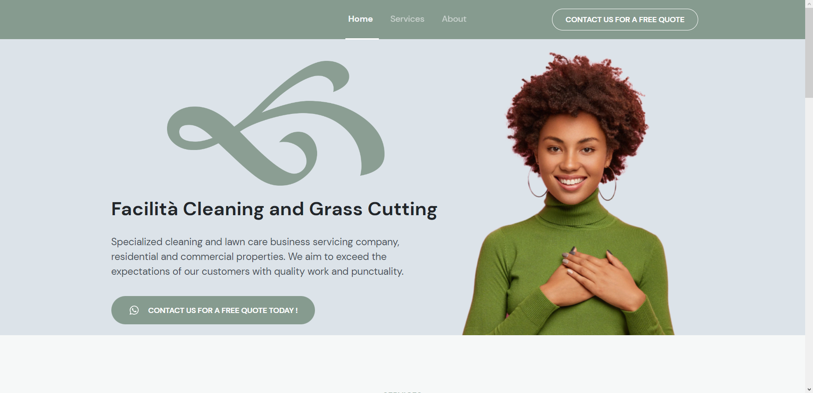

<h1 align="center"> Projeto do site de uma empresa de limpeza</h1>

  <a href="#-tecnologias">Tecnologias</a>&nbsp;&nbsp;&nbsp;|&nbsp;&nbsp;&nbsp;
  <a href="#-projeto">Projeto</a>&nbsp;&nbsp;&nbsp;|&nbsp;&nbsp;&nbsp;
  <a href="#-layout">Layout</a>&nbsp;&nbsp;&nbsp;|&nbsp;&nbsp;&nbsp;
  <a href="#memo-licença">Licença</a>

  

 

  

## 🚀 Tecnologias

Esse projeto foi desenvolvido com as seguintes tecnologias:

- HTML e CSS
- JavaScript
- Git e Github

## 💻 Projeto

Projeto construído para ajudar um amigo, site voltado para a apresentação geral da empresa e dos meios de contato para solicitar orçamentos. 

## 🌐 Deploy do projeto

- <a target="_blank" href="https://facilitaohio.com">Acesse aqui</a>

## :memo: Licença

Esse projeto está sob a licença MIT.

---
